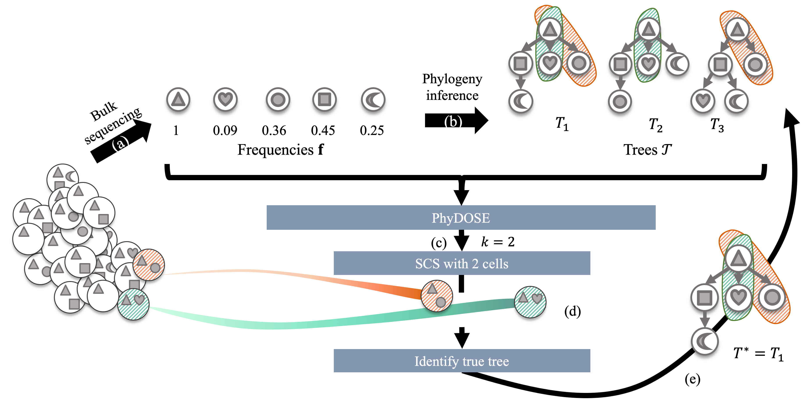

# PhyDOSE - Phylogenetic Design Of Single-cell sequencing Experiments

The input to PhyDOSE is a set of candidate trees, a frequency matrix obtained from bulk data, and a confidence level. PhyDOSE provides a minimum number of single cells needed in a follow-up single-cell sequencing (SCS) experiment to determine the true phylogeny among the set of given phylogenies with at least the desired probability.



## Contents

  1. [Getting started](#start)
     * [Dependencies](#dep)
  2. [Usage instructions](#usage)
     * [I/O formats](#io)
     * [Step 1: Generate the distinguishing feature family](#phi)
     * [Step 2: Calculate k*](#k_star)
     * [Step 3 (optional): Reconcile single cell data](#scs_exp)
     

<a name="start"></a>
## Getting started

PhyDOSE is written in C++ and R. The implementation was developed and tested in R Version 3.6.1. The repository is organized as follows:

| Folder    | DESCRIPTION                                                  |
| --------- | ------------------------------------------------------------ |
| `src`     | source code for PhyDOSE                                      |
| `data`    | example input data for PhyDOSE                               |


<a name="dep"></a>

### Dependencies   

PhyDOSE has the following R dependencies:

* [pmultinom](https://cran.r-project.org/web/packages/pmultinom/index.html) (1.0.)
* [dplyr](https://cran.r-project.org/web/packages/dplyr/index.html) (>= 0.8.3)
* [tidyr](https://cran.r-project.org/web/packages/tidyr/index.html) (>= 1.0)
* [stringr](https://cran.r-project.org/web/packages/stringr/index.html) (>= 1.4)


<a name="usage"></a>
## Usage Instructions

<a name="io"></a>
### I/O formats
The input to PhyDOSE is a .txt or .tsv file that contains edge lists for all candidate tree followed by a frequency matrix at the completion of the trees. See data/example/exampleTrees.txt for an example of the input file format. 

Optionally, after a single cell sequencing experiment has been performed, the use can use PhyDOSE to determine the support for each tree in the candidate based on the pre-calculated distinguishing features. The single cell sequencing file should be a csv file with mutation names as the column names and each row should represent one cell from the experiment. An entry has value 1 if the jth mutation was observed in the ith cell and 0 otherwise. In cases where the mutation names used in the single cell data do not match the mutation names in the tree file, then a csv mapping file can be utilized where the first column is the single cell mutation names and the second column has the mutation names used in the tree file.

<a name="phi"></a>
### Step 1: Generate the minimal distinguishing feature family for each tree 

Open a new terminal and navigate to the PhyDOSE directory.

Change the permisions of the bash script:
```
chmod 755 designBatch.sh
```
Navigate to the directory with the .txt or .tsv file containing the set of candidate trees:

```
cd data/example
```

Run bash script to generate the distinguishing feature files for each tree in the candidate tree file:
```
../../designBatch.sh

```
You should now see a new directory name **distFeats** that contains a csv file for every tree in the candidate set. Note that these files have already been generated for the example. 


<a name="k_star"></a>
### Step 2: Use PhyDOSE to calculate k* 

Navigate to PhyDOSE/src/R

```
cd PhyDOSE/src/R
```
Run PhyDOSE.r with the path to the file containing the set of candidate trees and any optional arguments:

```
Rscript PhyDOSE.r [path to file of trees] [confidence level] [false negative rate] [path to distinguishing features]
```

By default, PhyDOSE uses a confidence level of 0.95, a false negatve rate of 0 and assumes that the distinguishing feature files are located in a subdirectory of thge candidate trees file named **distFeats** as this is where PhyDOSE would create them by default in Step 1. 
Therefore, only the tree input file is a mandatory argument and all other can be optionally supplied by the user if they differ from the default values. The code below will run the the example with a confidence level of 0.9 and a false negative rate of 0.2.

```
Rscript PhyDOSE.r ../../data/example/exampleTrees.txt 0.9 0.2 ../../data/example/distFeats
```

<a name="scs_exp"></a>
### Step 3 [OPTIONAL]: Reconciling the SCS Experiment
If an SCS experiment has been conducted and a user wishes to reconcile the experiment against PhyDOSE's distinguishing features, the SCS_EXP.r script can be run in order to identify which trees had a non-zero support for the given single-cell data. 

```
cd PhyDOSE/src/R
```


```
Rscript PhyDOSE.r [SCS csv file path] [distinguishing feature directory] [mutation name map]
```

The first two arguments [SCS csv file path] and [distinguishing feature directory] are mandatory and the last argument is optional in the case that the mutation names in the SCS csv file do not exactly match the name of the muations used for the trees. A csv file can be supplied where the first column list the mutations names used in the SCS csv file and the second column has the corresponding mutation name used in the tree file. Note that is not neccessary for there to be an entry in the tree mutation column for every SCS mutation name entry. Thus, the second column may contain blanks. 

To run the example execute the following command:

```
Rscript PhyDOSE.r ../../data/example/sing_cell_data/SCS.csv  ../../data/example/distFeats
```
